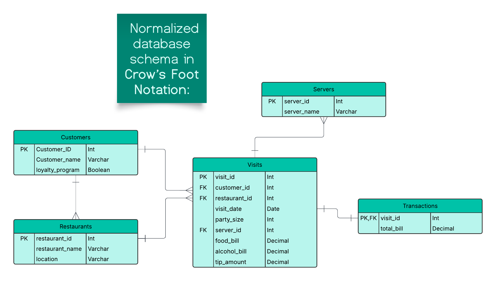

Practicum 1 - Part B

## **Functional Dependencies**
The relation represented by all columns in the CSV file contains various attributes related to restaurant visits. Below are the functional dependencies identified:

1. **Customer Dependencies**
   $$
   customer\_id \to customer\_name, loyalty\_program
   $$
   - A unique customer ID determines the customer’s name and their participation in the loyalty program.

2. **Restaurant Dependencies**
   $$
   restaurant\_id \to restaurant\_name, location
   $$
   - A unique restaurant ID determines the restaurant’s name and its location.

3. **Server Dependencies**
   $$
   server\_id \to server\_name
   $$
   - A unique server ID determines the server’s name.

4. **Visit Dependencies**
   $$
   visit\_id \to customer\_id, restaurant\_id, visit\_date, party\_size, server\_id, food\_bill, alcohol\_bill, tip\_amount
   $$
   - A visit ID uniquely determines all details about that specific visit.

5. **Revenue Dependency**
   $$
   food\_bill, alcohol\_bill, tip\_amount \to total\_bill
   $$
   - The total bill is derived from the sum of food, alcohol, and tip amounts.

## **Normalization to 3NF**
Using the functional dependencies and the rules of normalization, we decompose the relation into several tables that satisfy **Third Normal Form (3NF):**

### **1. Customers Table**
- **Attributes**: \( customer\_id (PK), customer\_name, loyalty\_program \)
- **Reason**: Each customer has a unique ID, and their details depend only on it.

### **2. Restaurants Table**
- **Attributes**: \( restaurant\_id (PK), restaurant\_name, location \)
- **Reason**: Each restaurant has a unique ID, and its details depend only on it.

### **3. Servers Table**
- **Attributes**: \( server\_id (PK), server\_name \)
- **Reason**: Each server has a unique ID, and their name depends only on it.

### **4. Visits Table**
- **Attributes**:  
  \( visit\_id (PK), customer\_id (FK), restaurant\_id (FK), visit\_date, party\_size, server\_id (FK), food\_bill, alcohol\_bill, tip\_amount \)
- **Reason**: `visit_id` uniquely determines all details about a visit.

### **5. Transactions Table**
- **Attributes**:  
  \( visit\_id (PK, FK), total\_bill \)
- **Reason**: The total bill is derived from `food_bill + alcohol_bill + tip_amount`, so it is stored separately.

## **Entity-Relationship Diagram (ERD)**
The following **ERD** represents the normalized database schema in **Crow’s Foot Notation**:

### **ERD Description**
- **Customers**: Stores unique customer details.
- **Restaurants**: Stores unique restaurant details.
- **Servers**: Stores server details.
- **Visits**: Stores individual visit details, linking customers, restaurants, and servers.
- **Transactions**: Stores total bill information related to each visit.

